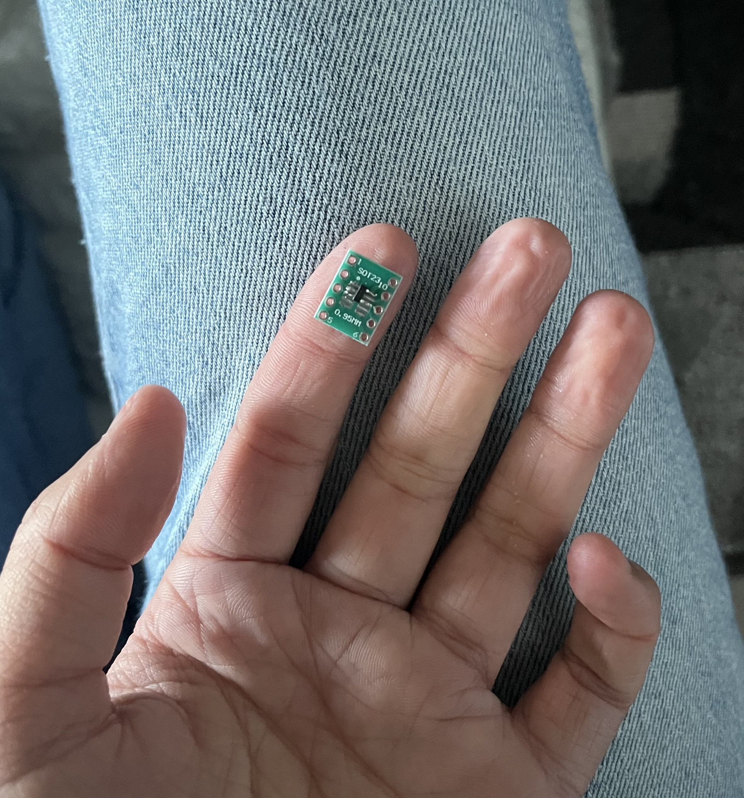

this page is still a work in progress! i will have more descriptions of the project soon, but feel free to scroll through the photos :) 

[the project](https://github.com/g0r3wh0r3/hydrogen-project)

I developed a prototype for a multimodal sensing system to monitor hydrogen concentration in natural gas pipelines. The system integrates ultrasonic and thermal conductivity sensors to determine hydrogen concentration. A machine learning model had been developed (not by me) to improve the accuracy of the results. This was run on a raspberry pi. I designed a PCB using KiCad, to power the sensors, acquire data from the sensors, and communicate with the raspberry pi. 

The PCB design went through several iterations.

Here's one of the earliest schematics. 

