I developed a prototype for a multimodal sensing system to monitor hydrogen concentration in natural gas pipelines. The system integrates ultrasonic and thermal conductivity sensors to determine hydrogen concentration. A machine learning model had been developed (not by me) to improve the accuracy of the results. This was run on a raspberry pi.

[go to the project](https://github.com/g0r3wh0r3/hydrogen-project)

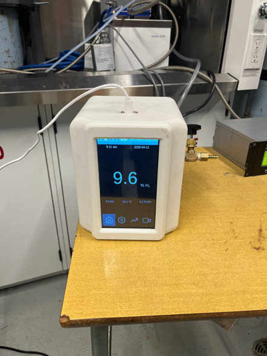

Here is the entire system set up and running! 

The project broke down to 3 main components: 
1. PCB 
2. Mechanical
3. Software   

# PCB
The PCB replaced a bunch of bulky benchtop equipment that was previously being used to collect data.

On the left side of this photo is all of the benchtop equipment and the computer that was previously being used. On the right side of the image is my PCB and the raspberry pi, which replaces all of that equipment. 

The PCB went through a lot of iterations. 

Here's one of the earliest schematics. 

While waiting for the PCB to arrive, some of the parts had already shipped. I started setting up a breadboard circuit to start testing running the code on the rpi with the peripherals. I did some workshops to learn to solder surface mount components, since I had no experience soldering.  Here's some photos of my first few attempts at surface-mount soldering, and testing running running the code with my breadboard setup. 

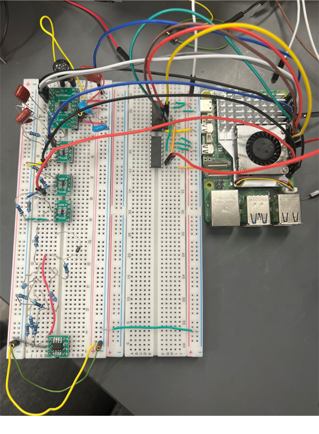

And here is the PCB! The PCB was ordered from JLCPCB. I would like to explore making PCBs myself, but that would've been very impractical for this project. 

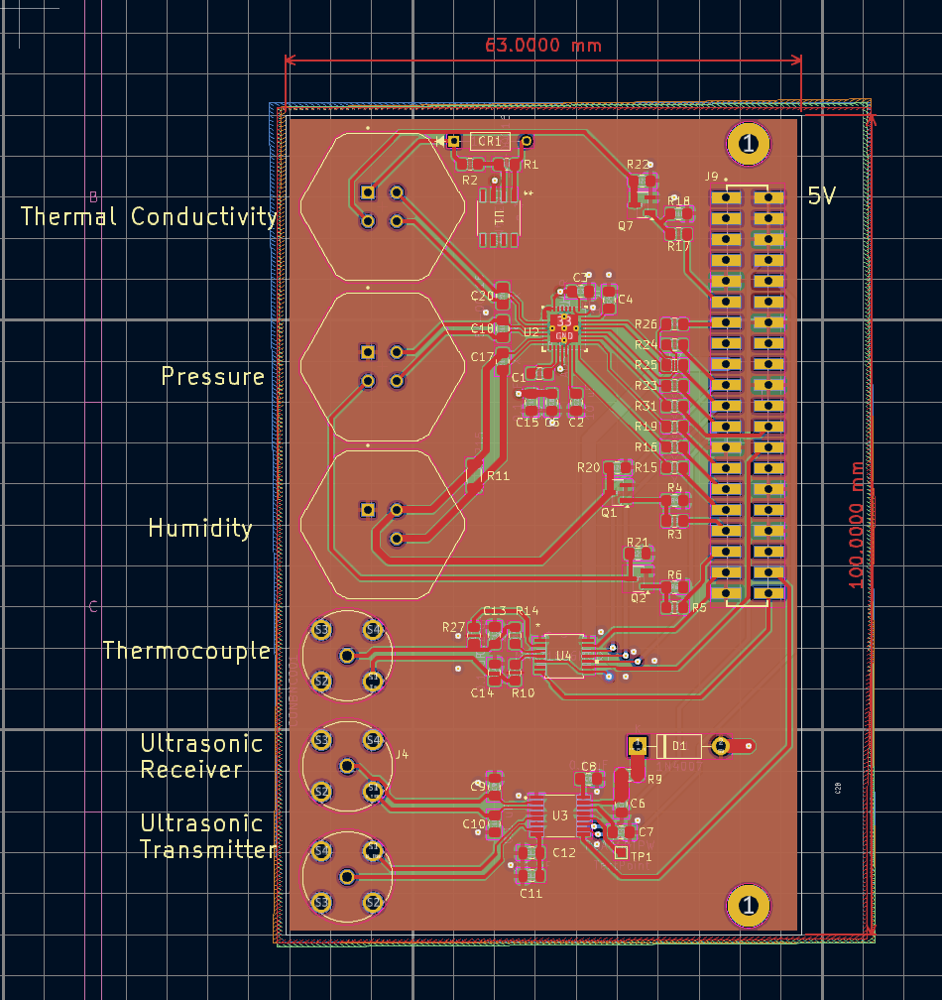

Here's the version of the schematic from when the PCB was ordered. 

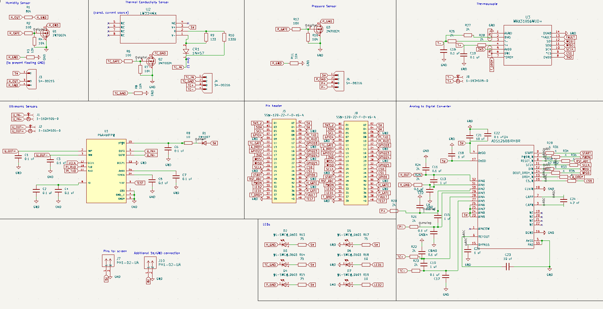

The FETs, Q1, Q2, and Q3, are switches that are controlled by GPIO pins on the pi, so that power to the humidity, thermal conductivity, and pressure sensors can be switched on and off through software. R3, R6, and R11 were just to have pads on the PCB that we could short to bypass the FETs in case that was problematic.  

The datasheet for the humidity sensor we were using said to connect an 80K resistor between the output and ground terminals, so that is the purpose of R1. 

The thermal conductivity sensor required a constant current supply of 1 mA, so I used an LM334 to provide a stable 1 mA, following the procedure outlined in the datasheet to calculate the values of R9 and R10. The diode has a negative temperative coefficient which cancels that of the LM334, so the current remains constant over temperature. 

I decided to use an IC to acquire data from the thermocouple and implement cold-junction compensation, as this would minimise the complexity of the design. 

Similarly, I chose to use an ultrasonic driver IC, the PGA460, for the ultrasonic transducers. 

I chose to use an ADS1260 to convert the humidity, pressure, and thermal conductivity sensors' output to ditigal. This was a terrible decision. I communicated poorly with supervisors, and misunderstood the required sampling rate and resolution, and thought we required a much higher sampling rate than we actually did. The only ADC I could find with such a high sampling rate was the ADS1260. There is hardly any documentation for using it and trying to figure out how to communicate with the ADC over SPI from the raspberry pi ended up being a huge bottleneck in the project. Furthermore, the ADS1260 is only available in a QFN package, which made it difficult to test things. I learned that it's often worth it to pick a less-than-ideal part if there is better documentation/support available. 

The 40-pin header connects to the pi GPIO pins.

The LEDs shown in the schematic were added to a revision of the schematic, intended for an updated version of the PCB.

I learned to use the reflow oven at the University of Calgary Makerspace, and assembled the PCB. 

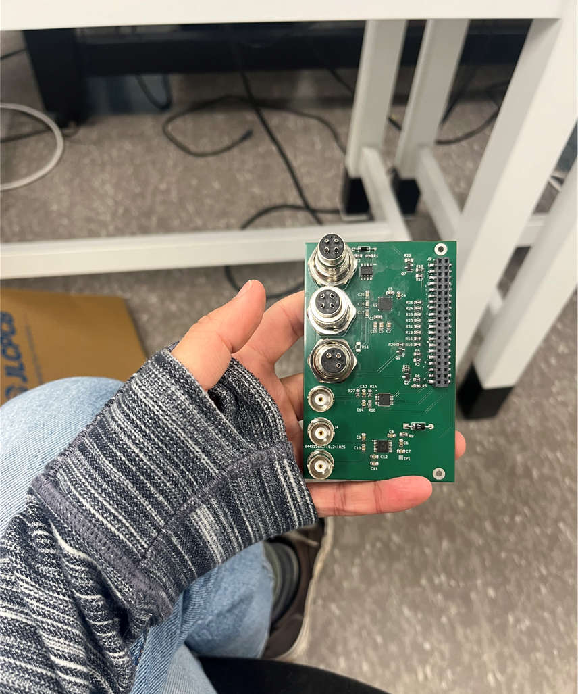

There were some other issues with the PCB. I didn't leave enough space between the cable connectors for the cables to actually fit, so I ended up having to solder one of the cable connectors to the bottom of the board instead. I picked up a lot of skills in reworking PCBs, such as cutting traces and making new connections to fix some of the issues with the PCB and try to debug the issues with the ADC. I did a lot of troubleshooting and debugging, isolating different parts of the system by moving ICs onto breakout boards and testing on a breadboard. 

After spending way too much time trying to get the ADC working, I attached a simpler ADC on a breakout board and was finally able to get data from the sensors. I learned that it's sometimes best to just take a solution that's ugly but works, and move on. I probably should have done that sooner and wasted less time trying to get the ADS1260 working. 

I started developing a new version of the PCB that fixes the errors with my design, but unfortunately didn't have time to finish it. I spaced the cable connectors out more so that all the cables would connect to the same side of the PCB. I also made the 40 pin header for the raspberry pi able to be connected to either side of the PCB, allowing for more flexibility in fitting the pi, PCB, and ribbon cable into the enclosure. I added LEDs for easier debugging. I would've liked to have updated the design with a different ADC, and learned more about how to prevent noise on the digital signal traces. I would also have liked to look into alternatives for the PGA460, as it was also a bit difficult to work with and might have been overkill for this project. I would have also liked to have designed a better power scheme, since currently the PCB and sensors draw power from the raspberry pi's GPIO pins. A raspberry pi 5 can handle it, but if the device were to be used with an older version of raspberry pi, it would be cutting a bit close to the maximum amount of power that the pi is able to supply to peripherals. Having a USB-C connector on the PCB, and have the PCB supply power to the raspberry pi as well might be better, but I was scared to try powering the pi from the PCB. 

# mechanical 

I designed a 3D-printed enclosure in Solidworks for the device. I selected a touch screen for the device, and created models including the screen, PCB, raspberry pi, pipe fittings, mounting screws, etc. 
 
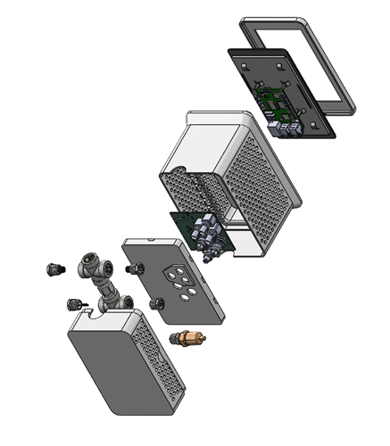

The enclosure went through a few iterations. I included ventilation holes and a separator between the pipe and the electrical components, features which would be good to have if the device is to be developed further. The enclosure was 3D printed in order to quickly have a physical prototype for demonstration/presentations. 

Here is the enclosure printing! I learned more skills with designing parts for 3D printing, and troubleshooting 3D printers.

Here are some photos of me assembling the pipe/sensors. I soldered the wired to each of the sensors, and set them in the pipe fittings filled with epoxy to prevent leaks. 

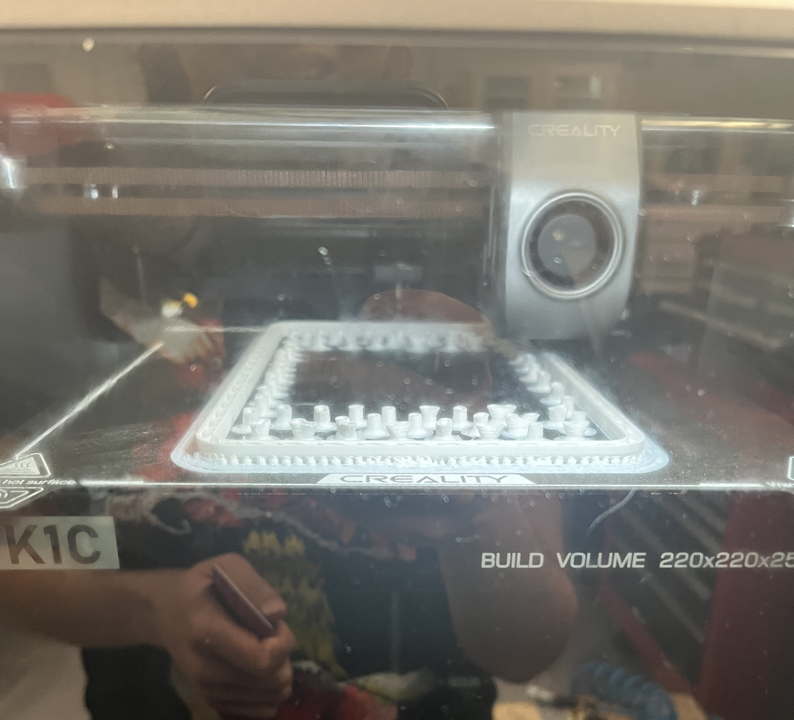
 

I created some models in SolidWorks that show what's going on more clearly. I soldered wires to the sensors, which were fed through the pipe fittings, connecting to the cable connectors at the other end. Septas and o-rings were used to hold the sensors in place and ensure a good seal, before the pipe fittings were filled with epoxy to seal them. 

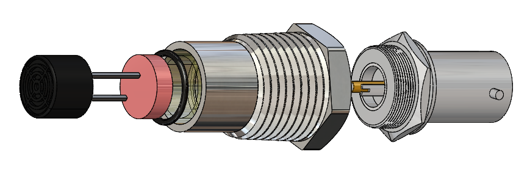

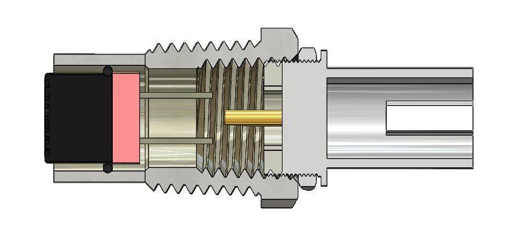

# software 

I coded a user interface for the device in Python using Tkinter. The UI had a home page, which displayed the current hydrogen concentration, a page showing plots updating live with data from each of the sensors, and a settings page where the user could change what units to display data with, how much time to average data with per point, and how often to upload data to the cloud (there were a lot of features . . . I had a lot of time while waiting for parts to ship). I learned to use the threading library to manage having the rpi aquiring data from the PCB, running the ML model to determine the hydrogen concentration, and keeping the UI running. I also created pages for data acquisition, which was really just going to be used when testing the prototype. 

Here is an image of me testing that everything looked good on the touch screen. Here are some screenshots of the other pages of the UI 

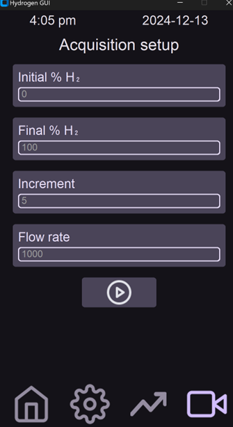

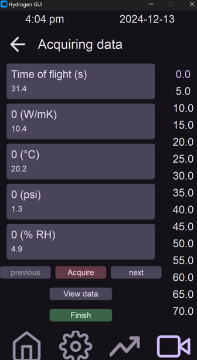

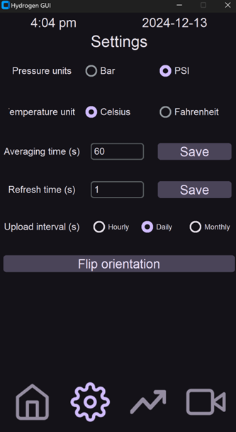

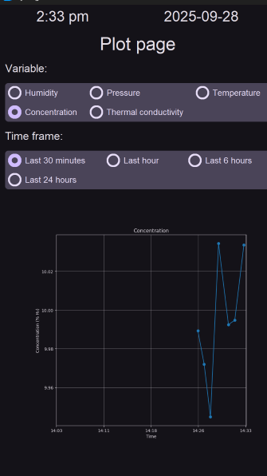