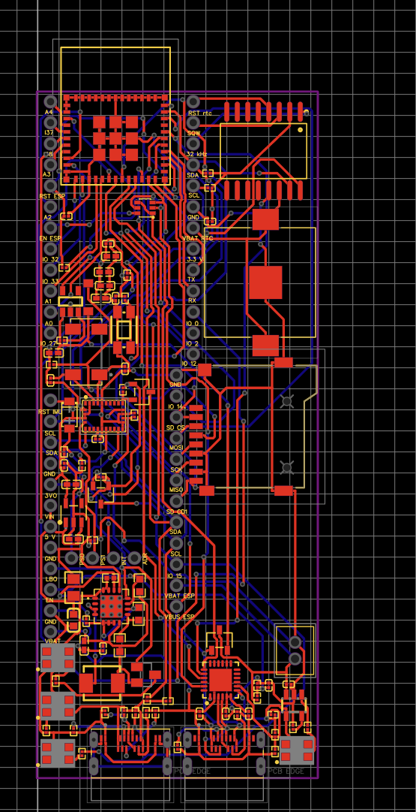
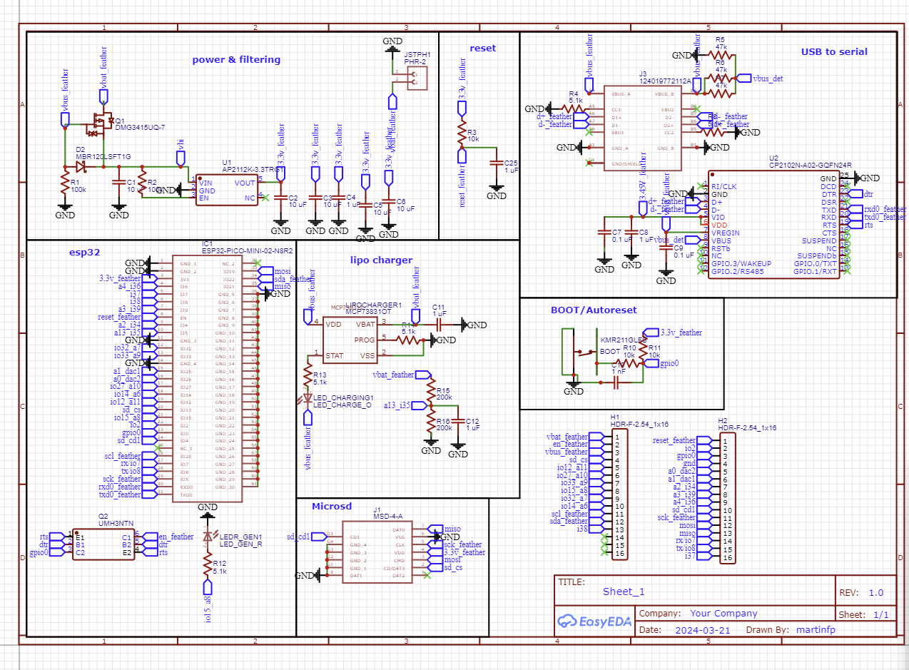
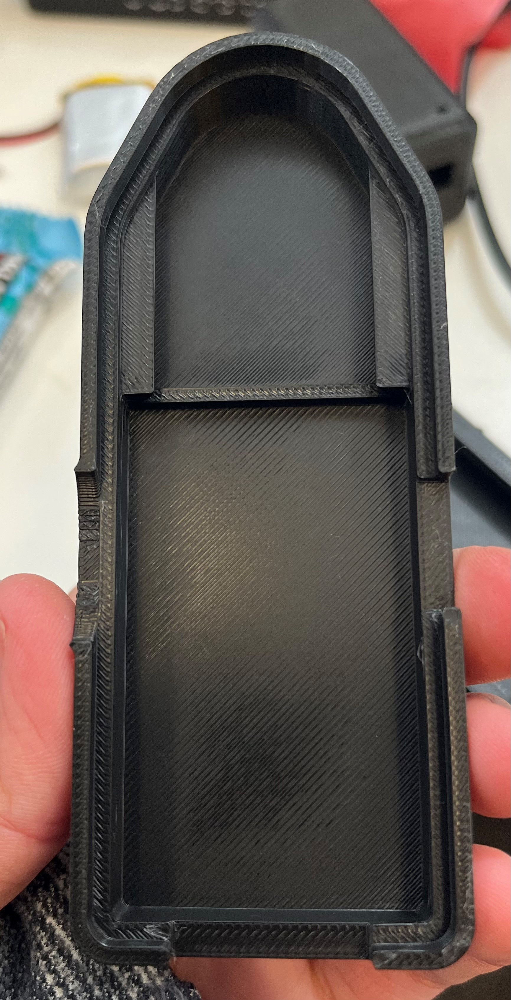

I designed ESP32 and ATSAMD21-based microcontroller boards to replace adafruit feather boards and breakout boards used by the lab in the previous prototype for the Sagitta device 

(Sagitta is a sensor that attaches to wheelchair wheels and collects data on velocity, push length, propulsion power, etc. https://www.clicknpush.ca/sagitta)

I designed a few different versions of the board. One was inspired by the Adafruit Feather M0 Basic, and included a separate bluetooth chip nRF51822, so I settled on a design using an ESP32 instead. 

There are definitely some mistakes in the schematic, but the PCB didn't ship until after I had finished my co-op term, so I wasn't around to rework the PCB. 

I designed the PCB using EasyEDA. This project was a pretty big task for my first introduction to PCB design. The size constraints were definitely challenging. If I were to re-do this project today, I would've definitely gone with a 4-layer board and had designated ground and power planes, and paid more attention to signal integrity in the layout as there are a lot of high-speed digital signals on the board. 

I also designed a custum 3D printed enclosure for the device using SolidWorks. Ensuring that the enclosure was accessible for users with limited hand mobility, not ugly, and kept the PCB and battery secured in place was a bit of a challenge. I settled on a snap-fit lid design with large notches to make it easier to open, and included supports for the PCB to ensure it stayed in place. 

I worked on this project (and assisted with a few others) at the Rehabilitation Robotics Lab at the University of Alberta from February 2024 to April 2024. 
